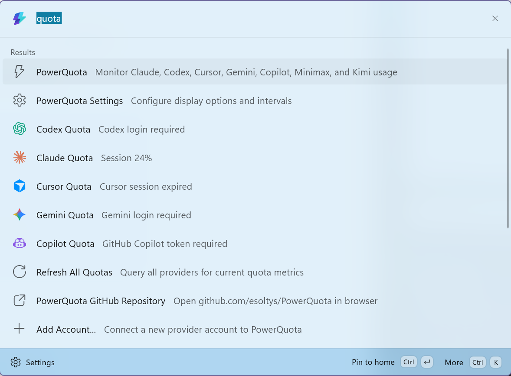
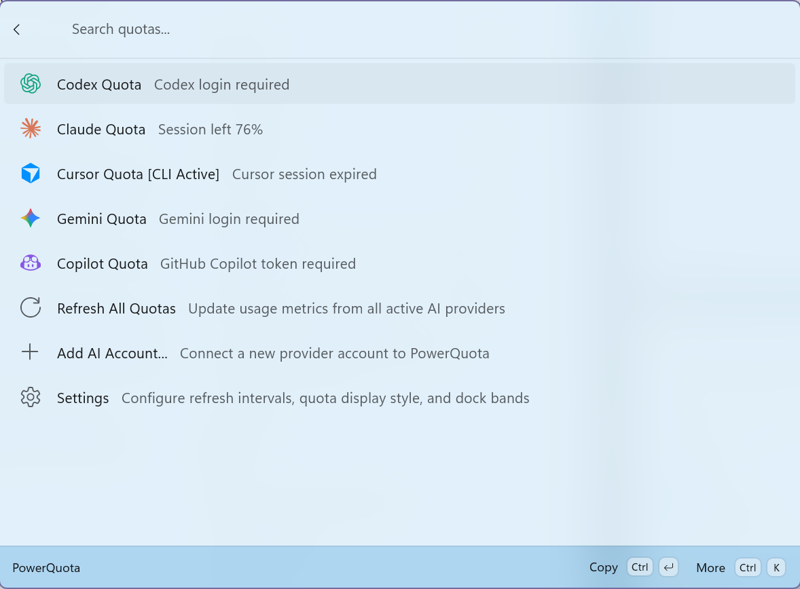
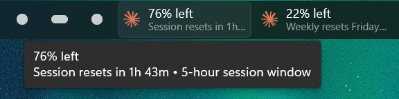
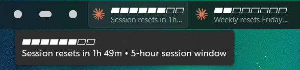
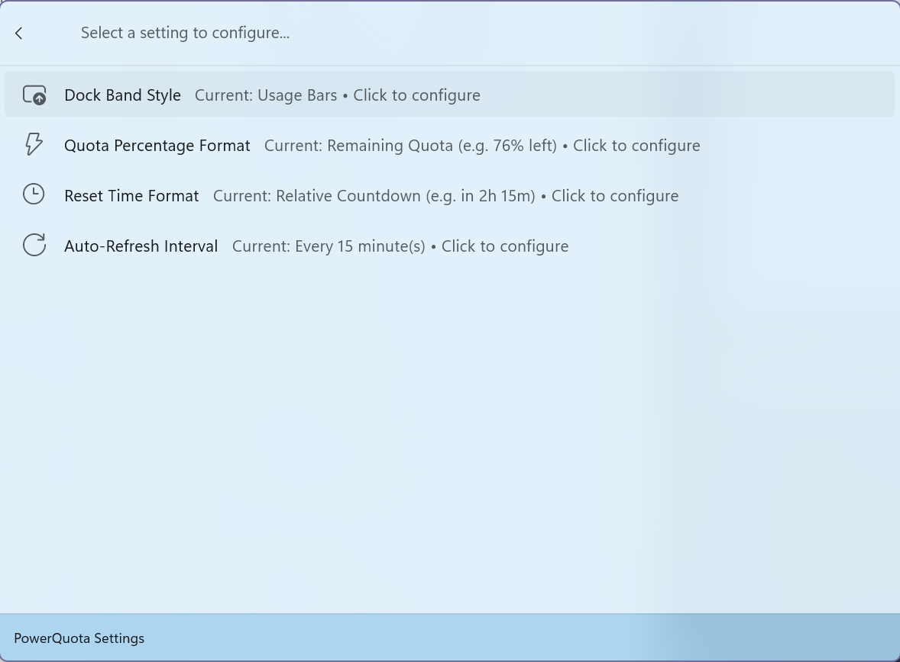
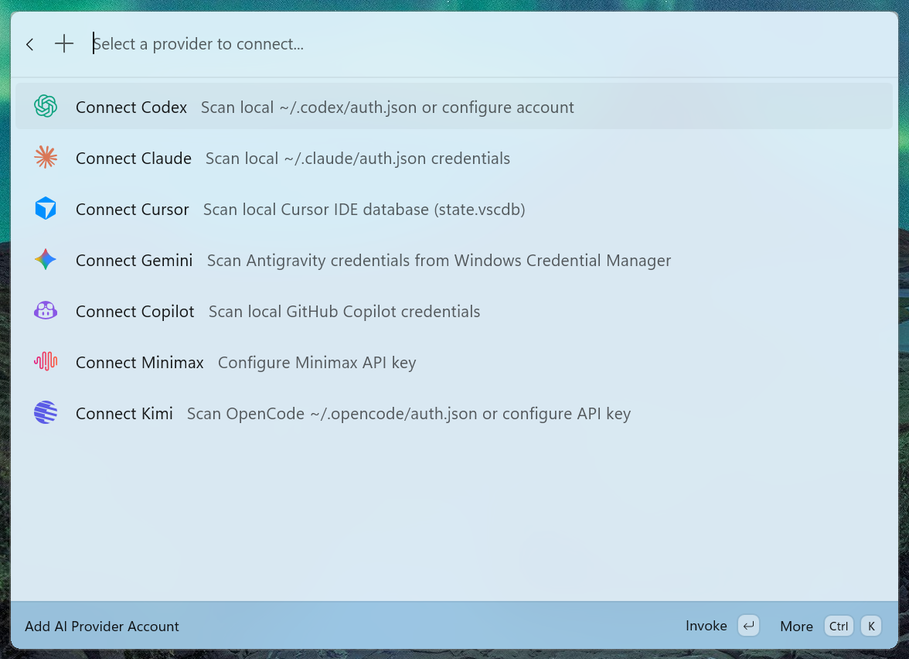

# PowerQuota (for PowerToys Command Palette & Dock)

A Windows-native extension for **PowerToys Command Palette** and the **PowerToys Dock** that tracks AI coding quotas for **Claude Code**, **Codex / ChatGPT**, **Cursor**, **Gemini Code Assist**, **GitHub Copilot**, **Minimax**, and **Kimi for Coding**.

([You didn't know PowerToys has a Command Palette Dock now?](https://learn.microsoft.com/en-us/windows/powertoys/command-palette/dock))

---

## Screenshots

| Command Palette | Overview & Quotas |
|:---:|:---:|
|  |  |

| PowerToys Dock Integration | Live Reset Tooltips |
|:---:|:---:|
|  |  |

| Settings & Preferences | Connect AI Providers |
|:---:|:---:|
|  |  |

---

## Highlights

- **7 Supported AI Providers**
  - **Claude Code**: 5h session windows, weekly model quotas (e.g. Claude 3.7 Sonnet, Opus), extra spend limits, and automatic `~/.claude/.credentials.json` discovery.
  - **Codex / ChatGPT**: 5h session limits, weekly windows, OpenAI credit balance, and `~/.codex/auth.json` host discovery.
  - **Cursor**: Safe read-only SQLite state scanning (`state.vscdb`), Fast/Composer and monthly request limits.
  - **Gemini (Google Code Assist)**: Multi-tier quota classification (Flash, Lite, Pro) with project resolution.
  - **GitHub Copilot**: Free chat/completions or paid premium interactions quota.
  - **Minimax**: 5h interval limits and weekly token plan quotas.
  - **Kimi for Coding**: Weekly usage and rate-limit windows + OpenCode auth prefill (`~/.opencode/auth.json`).
- **PowerToys Dock Integration**
  - Live persistent dock bands pinned directly to your PowerToys Dock.
  - Dynamic display modes: **Percentage** (`76% left`, `22% left`) or **Usage Bars** (`▰▰▰▰▰▰▱▱`).
  - Locale-aware reset countdowns and schedules (e.g., `Resets in 1h 52m` or `Resets Friday at 2:00 PM`).
- **Command Palette Experience**
  - **Overview List**: Dashboard of all configured AI providers accessible with `Alt + Space` / `Win + Shift + C`.
  - **Provider Details**: Drill down into session, weekly, extra spend, and credit balances.
  - **Settings Form**: Dedicated choice pages to toggle display styles, remaining vs used %, relative vs absolute clock times, and background polling intervals.
- **Privacy First & Local DPAPI Security**
  - Zero telemetry or third-party tracking. All requests go directly to official provider APIs.

---

## Privacy & Security

PowerQuota is designed from the ground up to respect developer privacy and protect sensitive credentials:

1. **Zero Telemetry & Zero Analytics**: PowerQuota does not collect, log, or transmit any analytics, telemetry, or user diagnostics.
2. **Direct-to-Provider Communication**: All API requests for quota metrics are made directly from your computer to the official AI provider endpoints (e.g. `api.anthropic.com`, `chatgpt.com`, `cursor.com`, `github.com`) over encrypted HTTPS/TLS. There are no intermediate cloud servers, proxies, or relays.
3. **Encrypted Local Storage (Windows DPAPI)**: All stored tokens and credentials are encrypted using the Windows Data Protection API (`System.Security.Cryptography.ProtectedData` with `DataProtectionScope.CurrentUser`). Credentials stored in `$env:LOCALAPPDATA\PowerQuota\vault.dat` are tied to your Windows user account and cannot be read by other users or transferred to another machine.
4. **Read-Only Local Host Scanning**: When auto-discovering existing CLI/IDE credentials (such as Claude Code `~/.claude/.credentials.json`, Codex `~/.codex/auth.json`, or Cursor SQLite databases), PowerQuota operates strictly in read-only mode and never alters your existing login session files.
5. **Open Source & Auditable**: The complete source code is open and verifiable under the MIT license.

---

## Project Structure

```
PowerQuota/
├── PowerQuota.sln
├── docs/                               # Documentation screenshots
├── src/
│   ├── PowerQuota.Core/                # AI quota engine, provider adapters, DPAPI vault, CLI scanner
│   │   ├── Engine/                     # QuotaRefreshService with exponential rate-limit backoff
│   │   ├── Models/                     # UsageSnapshot, UsageWindow, AppState, ProviderId
│   │   ├── Providers/                  # 7 AI provider adapters (Claude, Codex, Cursor, Gemini, etc.)
│   │   └── Storage/                    # WindowsCredentialVault, ConfigStorage, HostCliScanner
│   │
│   ├── PowerQuota.Core.Tests/          # Automated xUnit unit tests for all providers and storage
│   │   ├── ProviderTests.cs
│   │   └── StorageAndEngineTests.cs
│   │
│   └── PowerQuota.CommandPalette/      # WinRT COM Server extension for PowerToys Command Palette & Dock
│       ├── Assets/                     # Official brand vector SVG icons & assets
│       ├── Pages/                      # OverviewListPage, ProviderDetailsPage, AddAccountFormPage, SettingsFormPage
│       ├── Providers/                  # PowerQuotaCommandProvider (implements ICommandProvider4 & GetDockBands)
│       ├── Package.appxmanifest        # AppExtension com.microsoft.commandpalette manifest
│       └── Program.cs                  # COM out-of-process server entrypoint
```

---

## Getting Started

### Prerequisites
- Windows 10 (Build 19041+) or Windows 11
- [.NET 10.0 SDK](https://dotnet.microsoft.com/download/dotnet/10.0)
- [PowerToys](https://github.com/microsoft/PowerToys) (with Command Palette enabled)
- **Windows Developer Mode**: Must be enabled (**Settings** → **System** → **Advanced** → **Developer Mode**, or **System** → **For developers**) or run registration with Administrator privileges to install unpacked development packages.

### Building the Project

1. Open the repository directory in PowerShell:
   ```powershell
   cd PowerQuota
   ```

2. Restore and build:
   ```powershell
   dotnet build
   ```

3. Run automated tests:
   ```powershell
   dotnet test
   ```

### Publishing and Registering with PowerToys

1. Publish the Command Palette extension:
   ```powershell
   dotnet publish src/PowerQuota.CommandPalette/PowerQuota.CommandPalette.csproj -c Release -r win-x64 --self-contained false
   ```

2. Register the extension manifest with Windows:
   ```powershell
   Add-AppxPackage -Register "src\PowerQuota.CommandPalette\bin\Release\net10.0-windows10.0.26100.0\win-x64\publish\AppxManifest.xml"
   ```

3. Confirm registration:
   ```powershell
   Get-AppxPackage *PowerQuota*
   ```
   *Verify that `Status` reports `Ok`.*

4. Open **PowerToys Settings** -> **Command Palette**:
   - Enable **Command Palette** and **Enable Dock**.
   - Press `Win + Shift + C` (or configured shortcut) and type `powerquota` to view your AI quotas.
   - Pinned dock bands will appear in your persistent PowerToys Dock bar with real-time percentages or usage bars!

---

## Local Development & Fast Iteration

When developing or modifying PowerQuota locally, you can quickly iterate without reinstalling the entire package:

### 1. Enable External Reload in Command Palette
1. Open **Command Palette Settings** (`Win + Shift + C` then press `Ctrl + ,`).
2. Navigate to **Extensions** -> **Installed** (or scroll to the developer options).
3. Toggle **Enable external reload** to **On**.

### 2. Fast Build & Reload Script
Whenever you make C# or UI changes, run this one-liner in PowerShell to rebuild and instantly hot-reload Command Palette:

```powershell
Stop-Process -Name "PowerQuota.CommandPalette" -Force -ErrorAction SilentlyContinue
dotnet publish src/PowerQuota.CommandPalette/PowerQuota.CommandPalette.csproj -c Release -r win-x64 --self-contained false
Start-Process "x-cmdpal://reload"
```

### 3. Diagnostic Logs & Data Files
- **Live Extension Logs**:
  ```powershell
  Get-Content "$env:LOCALAPPDATA\PowerQuota\extension.log" -Wait -Tail 30
  ```
- **Configuration File**:
  `$env:LOCALAPPDATA\PowerQuota\config.json`
- **Encrypted Token Vault**:
  `$env:LOCALAPPDATA\PowerQuota\vault.dat` (Protected with Windows DPAPI)

---

## Acknowledgments

This project is a native Windows & PowerToys port inspired by and based on the work of [TopiCsarno/yapcap](https://github.com/TopiCsarno/yapcap) (originally created for the COSMIC desktop environment). Special thanks to [TopiCsarno](https://github.com/TopiCsarno) for their research into AI provider quota endpoints and rate-limit models.

---

## License

This project is licensed under the [MIT License](LICENSE).
